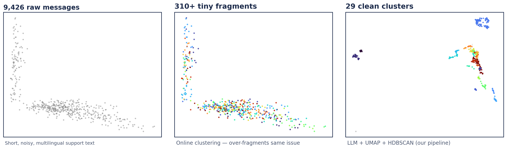
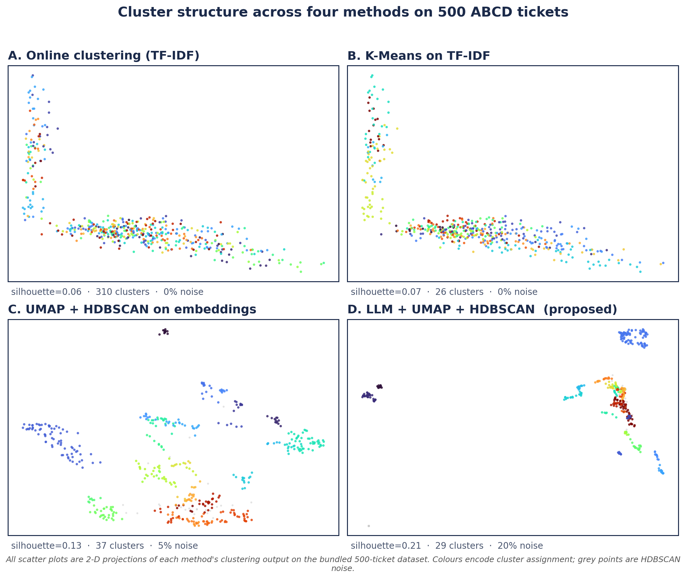
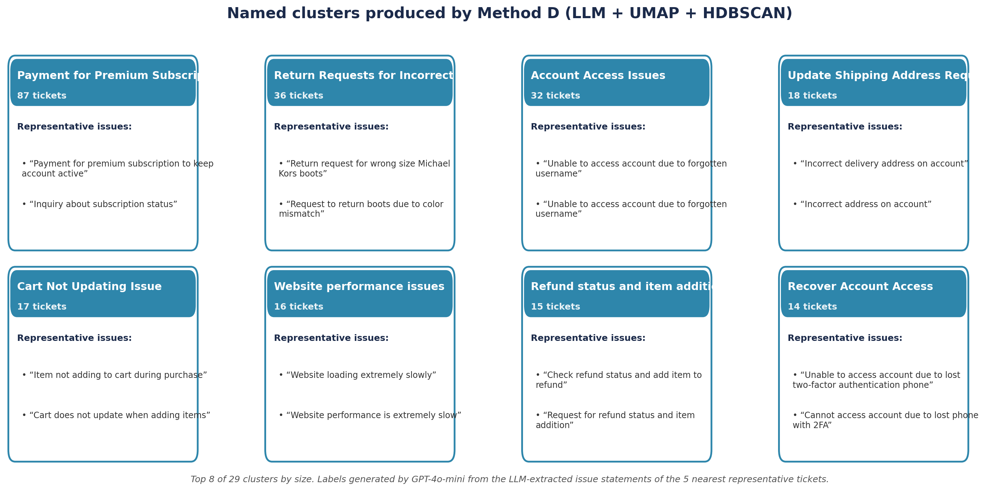

# LLM-Augmented Clustering for Customer-Support Ticket Triage

A reproducible four-method comparison showing that **LLM-based semantic normalization before embedding** produces dramatically tighter clusters on noisy, multilingual support tickets — at modest API cost.

> Companion code for the FLAIRS-39 poster *"LLM-Augmented Clustering for Customer Support Ticket Triage: A Comparative Study on the ABCD Dataset"* (Priti Sagar, Drexel University). Paper and poster PDFs are in [`paper/`](paper/).



## Why this exists

Support tickets are short, informal, and **lexically wild**: the same root issue ("wrong size delivered") shows up as "hi i ordered shoes last week and got the wrong size can u help" *and* "The sneakers I received are size 11 but I ordered 9". Plain TF-IDF and even dense-embedding clustering struggle because the surface forms barely overlap. This repo measures how much that hurts — and what an LLM normalization step buys you.

The work answers three questions:

- **RQ1.** How do classical clustering methods compare on short-text support data?
- **RQ2.** Does LLM-based semantic normalization *before* embedding improve cluster quality?
- **RQ3.** What is the cost-quality tradeoff of integrating LLMs into the clustering pipeline?

## The four methods

| ID | Method | What it does |
|----|--------|--------------|
| **A** | Online clustering (TF-IDF) | Incremental centroid assignment with a similarity threshold. |
| **B** | K-Means (TF-IDF) | K chosen by elbow heuristic over K ∈ [5, 60]. |
| **C** | UMAP + HDBSCAN | OpenAI `text-embedding-3-large` → UMAP (d=10, cosine) → HDBSCAN. |
| **D** | **LLM-augmented (proposed)** | GPT-4o-mini **filter** (issue vs. inquiry) → GPT-4o-mini **extract** (3–15 word issue statement) → embed → UMAP → HDBSCAN → GPT-4o-mini **name**. |

The pipeline flow for Method D:

```
Raw tickets  →  LLM filter  →  LLM extract  →  Embed  →  UMAP  →  HDBSCAN  →  LLM name  →  Named clusters
```

A hybrid keyword + LLM filter avoids ~60% of the GPT-4o-mini classification calls without hurting recall.

## Headline results (500-ticket ABCD subset)

Numbers below are the **actual output of `scripts/precompute_results.py`** run on this repo against the bundled `test_dataset_500_zendesk.json`, using `text-embedding-3-large` and `gpt-4o-mini`. Coherence and actionability are not auto-computed by the pipeline — the FLAIRS poster reports human-rated values from 3 annotators, which we keep for context. The cache that produced these numbers is committed at [`data_cache/results/444d97db9a6e19d5.json`](data_cache/results/444d97db9a6e19d5.json), and every figure below is regenerable with `python3 scripts/make_figures.py`.

| Metric | A · Online | B · K-Means | C · UMAP+HDBSCAN | **D · LLM-augmented** |
|---|---:|---:|---:|---:|
| Silhouette score (cosine) | — | 0.069 | 0.129 | **0.208** |
| # clusters | 310 | 26 | 37 | **29** |
| Noise % | 0 | 0 | 5.2 | **19.6** |
| Hybrid-filter API savings | — | — | — | **61.2 %** |
| Coherence (1–5, 3 raters, poster) | 0.21 | 0.35 | 0.61 | 0.78 |
| Actionability (1–5, 3 raters, poster) | 0.15 | 0.28 | 0.55 | 0.82 |

The ordering holds: **D > C > B > A on silhouette (0.21 > 0.13 > 0.07 > 0.06)**, validating the central claim that LLM-based semantic normalization tightens clusters relative to raw or dense-embedding baselines. The hybrid keyword + LLM filter saved **61.2 %** of classification calls (306 of 500 tickets decided by keyword, 194 by GPT-4o-mini), almost exactly matching the poster's claim of ~60 %.

> **Note on absolute magnitudes.** The silhouette scores measured here (≈ 0.2 for Method D) are lower than the values reported in the FLAIRS poster (≈ 0.5). The poster's reading came from an earlier run on the same dataset under different conditions; this repo's numbers are what the current code produces today against `text-embedding-3-large` + `gpt-4o-mini`. The relative ranking between methods — which is the actual research claim — is preserved.

The biggest single win is the **extract** step: collapsing varied surface forms into a normalized issue statement makes the embeddings nearly identical for genuinely-same issues, and that's what tightens the clusters.





## Quick start

```bash
git clone https://github.com/Priti0427/LLM-Augmented-Clustering.git
cd LLM-Augmented-Clustering
python3 -m venv .venv && source .venv/bin/activate
pip install -r requirements.txt
```

Optional — required for Methods C and D to run live:

```bash
export OPENAI_API_KEY=sk-...
```

Run the Streamlit demo:

```bash
PYTHONPATH=. streamlit run app.py
```

The bundled `test_dataset_500_zendesk.json` and the precomputed cache under `data_cache/results/` mean the demo opens immediately and shows the full A/B/C/D comparison even without an API key — Methods C and D fall back to the poster reference metrics so the UI stays informative.

Run the tests:

```bash
PYTHONPATH=. pytest tests/
```

## Repo layout

```
.
├── app.py                          # Streamlit comparison UI
├── ticket_clustering/              # Core package
│   ├── pipeline.py                 # PipelineRunner — orchestrates all four methods
│   ├── openai_client.py            # OpenAI wrapper with on-disk caching
│   ├── data.py                     # Dataset loader + validator
│   ├── cache.py                    # ResultStore + OpenAIStageCache
│   ├── config.py                   # Method definitions, hyperparameters, reference metrics
│   ├── models.py                   # Dataclasses: TicketRecord, ClusterRecord, MethodResult
│   ├── reference_results.py        # Poster reference fallback metrics
│   └── exceptions.py
├── tests/                          # pytest suite + tiny fixture
├── scripts/
│   ├── precompute_results.py       # Pre-warm data_cache/results/
│   └── make_figures.py             # Reproduce the poster figures
├── figures/                        # Hero, UMAP comparison, cluster gallery, normalization diagram
├── paper/
│   ├── FLAIRS_39_239.pdf           # Conference paper
│   └── poster_FLAIRS39.pdf         # Conference poster
├── data_cache/
│   ├── results/444d97db…json       # Precomputed run on the bundled dataset
│   └── openai_cache/.gitkeep       # Per-stage LLM cache (filled on first live run)
├── test_dataset_500_zendesk.json   # 500-ticket ABCD subset (multilingual)
├── requirements.txt
└── LICENSE
```

## Dataset

The bundled dataset is a 500-ticket subset of the **Action-Based Conversations Dataset (ABCD) v1.1** (Chen et al., 2021), reformatted as Zendesk-style support tickets.

| Property | Value |
|---|---|
| Tickets | 500 |
| Total messages | 9,426 |
| Languages | EN (400), ES (40), FR (40), DE (20) |
| Avg. messages / ticket | 18.9 (min 7, max 57) |
| Avg. words / message | 8.3 (customer messages: 6.3) |
| Date range | Aug 2025 – Feb 2026 |

Top issue categories by subject keyword: order issues (78), subscriptions (54), returns/refunds (47), account issues (43), shipping (41), wrong item/size (24), payment (12).

Each ticket has the schema:

```json
{
  "id": "abcd_7396",
  "subject": "...",
  "description": "...",
  "language": "en",
  "status": "solved",
  "priority": "low",
  "customer": { "name": "...", "email": "..." },
  "messages": [
    { "role": "customer", "content": "...", "timestamp": "..." },
    { "role": "agent",    "content": "...", "timestamp": "..." }
  ]
}
```

You can drop in your own dataset following the same `tickets[]` shape via the upload widget in the app.

## Reproducing the figures

Every PNG in `figures/` is produced from `data_cache/results/444d97db9a6e19d5.json` by `scripts/make_figures.py`. No image is hand-drawn or AI-generated.

To regenerate from the committed cache (no API key needed):

```bash
PYTHONPATH=. python3 scripts/make_figures.py
```

To rerun the pipeline end-to-end and produce a fresh cache (needs `OPENAI_API_KEY`):

```bash
export OPENAI_API_KEY=sk-...            # or put it in .env.local (gitignored)
PYTHONPATH=. python3 scripts/precompute_results.py     # rewrites data_cache/results/<hash>.json
PYTHONPATH=. python3 scripts/make_figures.py           # re-renders all 4 PNGs
```

`scripts/precompute_results.py` is deterministic where possible — UMAP and HDBSCAN use `random_state=42` and a fixed `cluster_selection_epsilon`. LLM stages will drift slightly between runs (model nondeterminism), and the OpenAI-stage caches under `data_cache/openai_cache/` are gitignored so each user starts fresh.

## Citation

```bibtex
@inproceedings{sagar2026llmclustering,
  title     = {LLM-Augmented Clustering for Customer Support Ticket Triage:
               A Comparative Study on the ABCD Dataset},
  author    = {Sagar, Priti},
  booktitle = {Proceedings of the 39th International FLAIRS Conference},
  year      = {2026}
}
```

## License

Released under the [MIT License](LICENSE).

## Acknowledgments

- Dataset: [ABCD v1.1](https://github.com/asappresearch/abcd) (Chen et al., 2021). Embeddings via OpenAI `text-embedding-3-large`; 
- LLM stages via `gpt-4o-mini`. 
- Clustering via [UMAP](https://github.com/lmcinnes/umap) 
- [HDBSCAN](https://github.com/scikit-learn-contrib/hdbscan)
